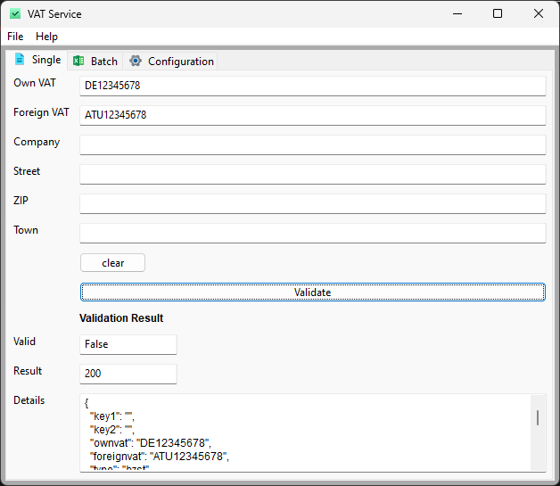
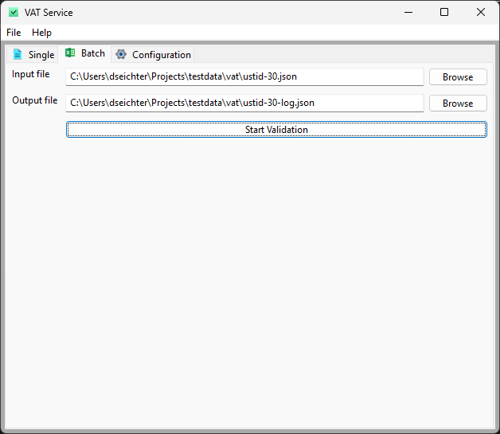
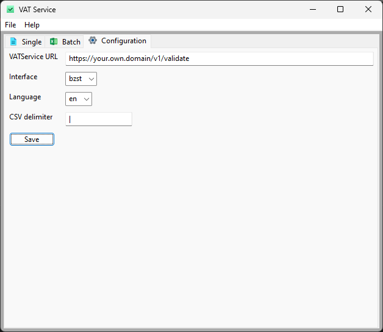

# vatservice-gui

User interface for the [vatservice](https://github.com/dseichter/vatservice) written in Python and wx. Use single or batch validation with support for CSV, XLSX and JSON.

## Badges


[](https://sonarcloud.io/summary/new_code?id=dseichter_vatservice-gui)

[](https://sonarcloud.io/summary/new_code?id=dseichter_vatservice-gui)

## Start development

Create and activate an environment by running the following command:

```python -m venv .venv```

```.venv/Scripts/activate```

Install the required dependencies

```pip install -r src/requirements.txt```

If you want to do some UI changes, download and install the latest wxFormBuilder from the [wxFormBuilder Homepage](https://github.com/wxFormBuilder/wxFormBuilder).

You can start the vatservice-gui by running the following command:

```python src/vatservice.py```

## Some screenshots

### Single validation



### Batch validation



### Configuration

